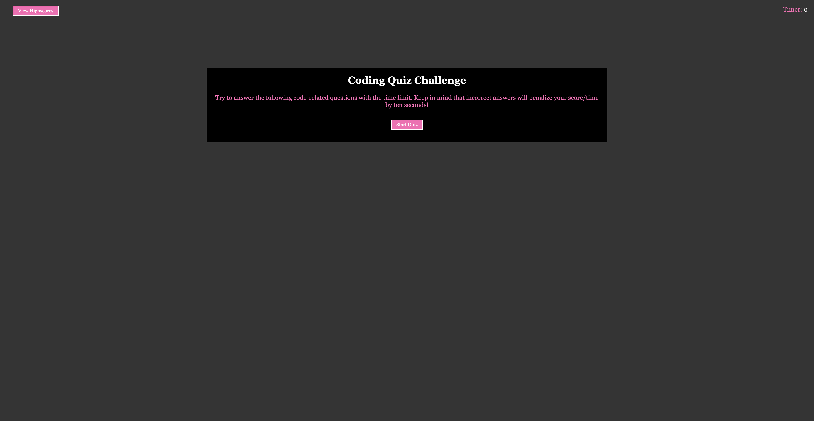

# Coding Quiz

## Description

This Coding Quiz was created to help the user become familiar with tests and give he or she a chance to apply the skills from past modules. The Coding Quiz is a timed quiz with multiple-choice questions.

## Installation

N/A

## Usage

To use this Coding Quiz, simply click the "start" button. You will be directed to the first multiple-choice question. You will have 50 seconds total (10 seconds per question). Click the answer you think is correct and you will be directed to the next question. Once you have answered all the questions, you will be shown your score and prompted to enter your initials. You can also view the highsores by clicking the button. This button will show all saved highscores. This can be cleared by pressing the "Clear" button. Play as many times as you'd like.

View screenshot of webpage below:

Link to webpage: https://nstark12.github.io/coding-quiz/

## Credits

N/A

## License

Please refer to the LICENSE in the repo.
